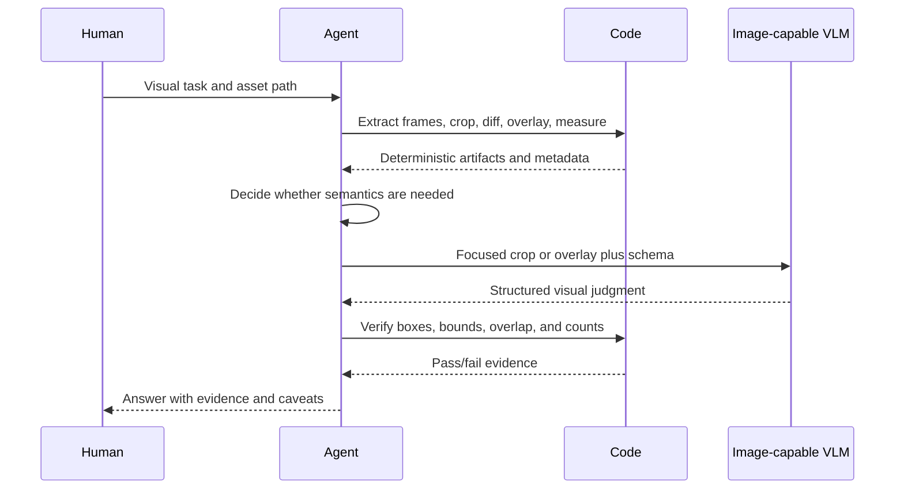

# Human-Agent Loop

CGV gives the human and the agent a shared rule: inspect with code first, then ask a vision model only for judgment.

---

## Roles

### Human

The human supplies the visual task, the asset, and the success criterion.

Good requests name:

- The asset path or screenshot source.
- The visual question.
- The region, frame range, or object of interest.
- The acceptable output format.

Example:

```text
Check shot_014.mp4. Does the logo stay fully visible in the lower-right corner from 00:02 to 00:05? Return yes/no, evidence frames, and any caveats.
```

### Agent

The agent turns the request into evidence:

1. Locate the asset.
2. Extract frames or crops.
3. Compute deterministic checks.
4. Register artifacts with paths, dimensions, and hashes when possible.
5. Ask an image-capable VLM only for semantic judgment.
6. Verify geometry and structured output.
7. Report observed evidence, VLM judgment, and caveats.

---

## Loop



---

## What the agent should say

A good CGV answer separates evidence from judgment:

```text
Answer: Yes.
Local evidence: extracted frames at 2.0s, 3.0s, 4.0s, and 5.0s; crop bounds were inside the 1920x1080 frame; pixel diff showed no logo disappearance.
VLM judgment: the focused lower-right crop contains the same logo in all four frames.
Verification: logo boxes stayed within frame bounds; minimum IoU between adjacent boxes was 0.91.
Caveat: compression blur increases at 5.0s, but the logo remains readable.
```

A weak answer hides the process:

```text
The logo looks fine.
```

---

## Human review checklist

Ask for a redo if the agent:

- Gives a visual answer with no extracted artifact.
- Sends a full image when a crop would answer.
- Treats VLM coordinates as fact.
- Uses a text-only model for an image question.
- Skips geometry checks for overlap, containment, or bounds.
- Does not mention caveats for blur, occlusion, compression, or low resolution.

---

## Escalation

The agent must stop and report the blocker when:

- The asset path is missing or unreadable.
- FFmpeg, Pillow, OCR, or another required local tool is unavailable.
- No image-capable VLM is configured.
- Provider auth or upload fails.
- The question needs segmentation, depth, or pose and no adapter exists.

Stopping is better than inventing visual evidence.
