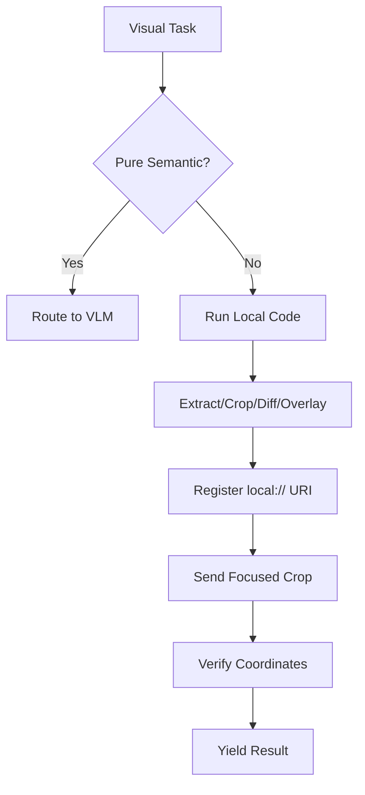

# Visual Grounding Rubric for Agents

Use this skill for visual or spatial assets: video frames, screenshots, layouts, and overlays. Inspect with code before asking a VLM for judgment.

---

## 1. Trigger conditions

Load this rubric for:
- Video QC, keyframes, scene boundaries, continuity audits.
- UI layout inspection, screenshot debugging, alignment.
- Contrast checks and logo or watermark placement.
- Generated image or video QC against prompt constraints.

Skip it for text-only code, research, docs, or package config.

---

## 2. Deterministic-first protocol

Split the work:
1. Deterministic layer: local CPU code in Jupyter, IPython, or shell. Compute, crop, diff, or measure first.
2. Semantic layer: remote image-capable VLM. Use it only for judgment code cannot supply.

Action steps:
1. For detail questions, crop the region before sending it to a VLM.
2. For frame counts or scene boundaries, use `ffprobe`, FPS, and frame indices.
3. For overlap questions, calculate box geometry in code. Use a VLM only to judge the cropped overlap.

---

## 3. Failure control

- Registry probe: query the model registry. If no model reports `input=['text', 'image']`, or the vision API returns auth or connection errors, return a configuration error. Do not fall back to text-only completion.
- VLM boxes: treat coordinates as proposals. Confirm them with crop-and-re-ask, overlay review, or intersection math.

---

## 4. Loop discipline

1. Use one transform or inspection per step: extract frames, check stats; crop, inspect; diff, verify.
2. Register each generated image with `register_artifact(path, label, purpose)` or the local equivalent. Include metadata in the next observation.
3. Require a structured schema, such as `VisualGroundingResult`, for VLM calls.

---

## 5. Decision rubric

- Can FFmpeg or Pillow answer it?
  - Frame count, dimensions, file type, histograms, duplicate hashes, pixel diffs.
  - If yes, run locally and skip the VLM.
- Does it need semantic judgment?
  - Examples: obscured face, medieval styling, logo placement.
  - If yes, send the exact crop, prompt, and schema to a remote VLM.
- Does it need segmentation or depth?
  - Examples: SAM masks, Depth-Anything depth maps.
  - If yes, route to a remote GPU adapter. If none is configured, report the constraint; do not emulate large weights on CPU.