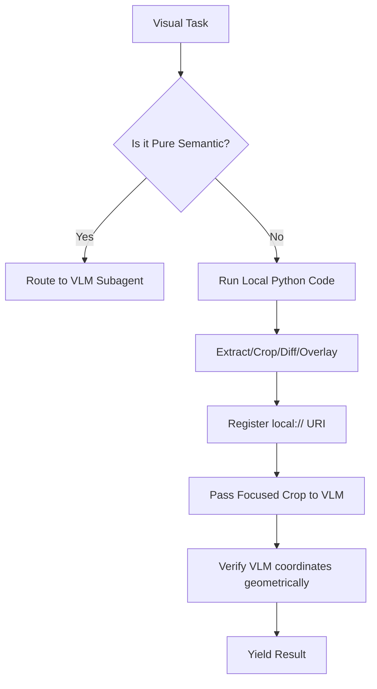

# Declarative Visual Grounding Rubric for Agents

This skill governs how an agent makes decisions and executes tasks involving visual or spatial assets (video frames, screenshots, layouts, overlays). It enforces code-grounded inspection before semantic VLM queries.

---

## 1. Trigger Conditions
Load this rubric only if the active task contains a visual component:
- Video QC, keyframe checks, scene boundaries, continuity audits.
- UI layout inspection, screenshot debugging, alignment.
- Contrast checks, logo/watermark overlay checks.
- Creative generation QC (checking if an AI video matches prompt constraints).

If the task is purely textual (code refactoring, general research, docs, package config), **do not trigger this rubric**. Keep the context lean.

---

## 2. Core Protocol: Deterministic-First

Every visual task must be decomposed into two distinct layers:
1. **Deterministic Layer (Local CPU Code)**: Runs in the persistent sandbox (Jupyter, IPython, OS shell). Always try to compute or isolate first.
2. **Semantic Layer (Remote VLM Subagent)**: Runs via remote image-capable API. Only for high-level judgment.

### Action Steps:
1. **Never send high-res original frames directly to VLM** if the question is about a specific detail. Write Python code to `crop` the region of interest first.
2. **Never ask VLM to count frames or detect boundaries.** Write shell scripts using `ffprobe` to get metadata, FPS, frame indices.
3. **Never ask VLM to detect overlapping coordinates.** Write code to calculate bounding box overlap geometry. Use VLM only to inspect the overlapping region for semantic impact (e.g. "does this overlap hide text?").

---

## 3. Failure Control (Fail-Closed)

To prevent visual hallucinations, the agent must enforce strict fallback controls:
- **Registry Probe:** Query the model registry. If no model reports `input=['text', 'image']`, or if the vision API returns auth/connection errors:
  - **Do NOT fallback to text-only completions.**
  - **Fail closed** by returning an explicit configuration error to the user stating VLM capability is missing.
- **Hypothesis vs Truth:** If a VLM returns bounding box coordinates, they are **hypotheses**. The agent must write Python code to crop those coordinates and visually inspect them (or calculate intersection math) to confirm they match.

---

## 4. Loop Discipline for Visual Tasks

When working on a visual task:
1. **One transform/inspection per cell/step:** Avoid monolithic script execution. Run frame extraction, then check stats; crop, then inspect; diff, then verify.
2. **Artifact Registry:** Register every image produced during execution using `register_artifact(path, label, purpose)` or equivalent. Ensure the next observation contains the metadata for that artifact.
3. **Structured Grounding:** Always enforce a structured output schema (like `VisualGroundingResult`) for VLM calls to lock down responses.

---

## 5. Decision Rubric

- **Step A: Can FFmpeg/Pillow resolve it?**
  - Frame count, image dimensions, file type, color histograms, exact duplicate detection (hashing), visual diff (pixel subtraction).
  - *If Yes: Execute locally, do not call VLM.*
- **Step B: Does it require semantic understanding?**
  - "Is character face obscured by hair?", "Does the styling read as medieval?", "Is the logo placement aesthetically pleasing?".
  - *If Yes: Call remote VLM with the exact cropped image + prompt + schema.*
- **Step C: Does it require heavy segmentation/depth?**
  - Pixel-perfect masking (SAM), 3D depth-map reconstruction (Depth-Anything).
  - *If Yes: Route to remote GPU perception adapter. If not configured, report constraint gracefully; do not attempt CPU emulation of large weights.*
